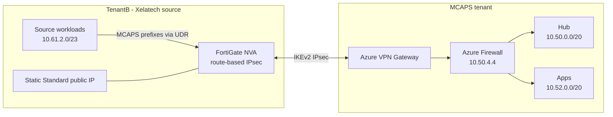

# SRE-Demo - SRE Demo Deployment Plan

## Architecture

Two independently deployed Azure tenants connected by a route-based site-to-site IPsec VPN:

- **TenantB (`xelatech.net`)** hosts the simulated source estate behind a low-cost FortiGate NVA.
- **MCAPS** hosts the landing-zone hub, Azure Firewall, VPN Gateway, Arc/Azure Migrate control plane, and migration targets.
- The tenants exchange only VPN endpoint metadata, address prefixes, and an out-of-band pre-shared key. They do not use cross-tenant VNet peering or cross-tenant resource IDs.

### Subscription Layout

```bash
# MCAPS landing-zone and migration-target subscriptions
hubSubId="ebc6a927-fe4b-49dc-8e99-3ffe8e8d01d9"   # hub subscription
appsSubId="42021d44-97d2-47a1-8245-a77149dda4c3"  # apps-spoke subscription

# TenantB source simulation
tenantBSubId="ed70102f-f789-4d4e-ac00-074283844a0c" # Xelatech Visual Studio subscription
```

MCAPS is the landing-zone, migration-control-plane, and migration-target context. TenantB is deliberately outside MCAPS so Arc onboarding and Azure Migrate discovery resemble a separate source estate.

Before operating on the source environment, establish and verify its context explicitly:

```bash
az login --tenant xelatech.net
az account set --subscription "$tenantBSubId"
az account show --query '{tenantId:tenantId, subscriptionId:id, name:name, user:user.name}' -o table
```

Do not assume that setting a subscription changes the signed-in tenant. Login to TenantB first, deploy `main/tenantb/tenantbmain.bicep`, record its outputs, and then establish a separate MCAPS login before validating or deploying the hub.

## CIDR Scheme

| Security zone | Address space | Purpose |
| --- | --- | --- |
| MCAPS hub | `10.50.0.0/20` | Azure Firewall, VPN Gateway, DNS, and shared services |
| MCAPS apps spoke | `10.52.0.0/20` | Application and migration-target workloads |
| MCAPS DC spoke | `10.53.0.0/20` | Optional MCAPS infrastructure spoke |
| TenantB | `10.61.0.0/20` | Independently deployed source estate |
| TenantB FortiGate external | `10.61.0.0/27` | Public-side FortiGate NIC |
| TenantB FortiGate internal | `10.61.0.32/27` | Trusted-side FortiGate NIC |
| TenantB management | `10.61.1.0/24` | Administrative systems |
| TenantB source workloads | `10.61.2.0/23` | Arc, SQL, and migration source systems |

`10.51.0.0/20` is retired from the active design. TenantB is a VPN-connected remote site, not an MCAPS spoke.



---

## AVM Module Status (hub)

Repository-wide AVM adoption and non-AVM review backlog:
- See `docs/avm-module-review.md` for full inventory, conversion waves, and keep-custom decisions.

All hub resources migrated to AVM in `main/hub/hubmain.bicep`.
Custom modules kept where AVM replacement adds no value (complex UDR/peering/firewall policy logic).

| Resource | AVM Module | Status |
|----------|-----------|--------|
| ACR | `avm/res/container-registry/registry:0.9.3` | done |
| Log Analytics | `avm/res/operational-insights/workspace:0.9.1` | done |
| App Insights | `avm/res/insights/component:0.7.1` | done |
| DCR (base + perf) | `avm/res/insights/data-collection-rule:0.10.0` | done |
| Storage | `avm/res/storage/storage-account:0.14.3` | done |
| Windows VM | `avm/res/compute/virtual-machine:0.9.0` | done |
| Linux VM | `avm/res/compute/virtual-machine:0.9.0` | done |
| Bastion | `avm/res/network/bastion-host:0.8.2` | done |
| DNS Resolver | `avm/res/network/dns-resolver:0.5.6` | done |
| DNS Forwarding Ruleset | `avm/res/network/dns-forwarding-ruleset:0.5.3` | done |
| Key Vault | `avm/res/key-vault/vault:0.9.0` | done |
| VPN Gateway | `avm/res/network/virtual-network-gateway:0.9.0` | done |
| Local Network Gateway | `avm/res/network/local-network-gateway:0.4.0` | done |
| VPN Connection | `avm/res/network/connection:0.1.6` | done |
| Hub VNet | `modules/hub/hubvnet.bicep` (custom - kept) | done |
| Firewall | `modules/hub/firewall-vnet.bicep` (custom - kept) | done |
| Private DNS links | `modules/hub/privatednslinks.bicep` (custom - kept) | done |
| DCR Association | `modules/hub/dcr-association.bicep` (custom - kept) | done |

--- 

## TenantB Source Deployment

TenantB is deployed from `main/tenantb/tenantbmain.bicep` while authenticated to `xelatech.net`. It owns its VNet, FortiGate NVA, public IP, route tables, and source workload subnet. It does not reference the MCAPS subscription, VNet, firewall, identities, monitoring resources, or DNS zones.

The FortiGate uses two NICs with IP forwarding enabled. The workload route table sends only declared MCAPS prefixes to the FortiGate internal private IP. Static routing and BGP disabled are the defaults for this demo.

| Source role | Recommended platform | Purpose |
| --- | --- | --- |
| Arc server | Supported Windows Server VM | Connected Machine onboarding, inventory, policy, monitoring, and update-management demo |
| Legacy SQL source | Windows Server 2019 x64 + SQL Server 2016 SP3 Developer | Azure Migrate discovery, Arc-enabled SQL assessment, and migration into MCAPS |

The previous Tahubu `WS2012R2_SQL2014_Base` community image has been withdrawn and cannot be used. A direct Azure VM may be Arc-enabled only as an evaluation simulation, and Arc-enabled SQL Server does not support SQL Server installed directly on an Azure VM. For a combined Arc SQL demonstration hosted from the Xelatech subscription, place the SQL workload in a nested x64 guest or use an external x64 virtualization host reachable by the migration tooling.

The source compute belongs to TenantB. Register the nested/external guest as an Arc resource in MCAPS and place the Azure Migrate project in MCAPS, making MCAPS the assessment and migration control plane as well as the destination tenant.

DSC scripts from `https://raw.githubusercontent.com/{repositoryOwner}/migrate-to-azure-landing-zone/{repositoryBranch}/...`
Defaults: `repositoryOwner=microsoft`, `repositoryBranch=main`.

### Lab Credentials (from original tailspin lab)

| Credential | Value | Used For |
|-----------|-------|---------|
| `adminUsername` | `demouser` | VM local admin (both VMs), SQL MI admin login |
| `labPassword` | `demo!pass123` | VM admin password, DSC `DatabasePassword` (SQL restore SA password) |

`labPassword` is a required param in `datamain.bicep` with no default — pass inline at deploy time:
`--parameters labPassword='demo!pass123'`

NSG removed. Azure Firewall (`10.50.4.4`) is the sole control plane via UDR `0.0.0.0/0 -> AzFW`.

---

## Firewall Rules (firewall-vnet.bicep)

| Rule Collection | Group Priority | Notes |
|----------------|---------------|-------|
| `AllowTrustedAzureTraffic` | 300 | East-west within Azure subnets. Ports incl. 1433, 5022, 11000-11999 |
| `AllowAzureToTenantB` | 300 | MCAPS to TenantB direction. Same port set |
| `AllowTenantBToAzure` | 300 | TenantB to MCAPS direction. Same port set |

IP Group `trustedAzureSubnets`: `10.50.0.0/20` (hub), `10.52.0.0/20` (apps), `10.53.0.0/20` (optional DC)
IP Group `trustedTenantBSubnets`: `10.61.0.0/20`
IP Group `infraServerSubnets`: `10.50.0.0/24`, `10.52.0.0/24`, `10.53.0.0/24` (internet egress rules)

---
```text
TENANTB WORKLOAD SUBNET (10.61.2.0/23)
  MCAPS prefixes -> FortiGate internal IP 10.61.0.36

FORTIGATE NVA
  Static FortiOS routes for 10.50.0.0/20, 10.52.0.0/20, and 10.53.0.0/20
  Route-based IKEv2 IPsec tunnel -> MCAPS VPN Gateway public IP

MCAPS GATEWAY SUBNET
  Specific MCAPS address spaces -> Azure Firewall 10.50.4.4
  No 0.0.0.0/0 UDR

MCAPS AZURE FIREWALL SUBNET
  TenantB 10.61.0.0/20 learned through LNG gateway route propagation
  0.0.0.0/0 -> Internet retained as required for Azure Firewall

MCAPS WORKLOAD SUBNETS
  0.0.0.0/0 -> Azure Firewall 10.50.4.4
  Gateway route propagation disabled to prevent inspection bypass
```

## Apps-Spoke VM Inventory (SQL VM)

Deployed via `main/apps-spoke/appsmain.bicep` using AVM `compute/virtual-machine:0.9.0`.
Subscription: `$appsSubId` (centralus)

| VM | RG | Image | Purpose |
|----|----|-------|---------|
| `AppsVM` | `AppsRG-VM` | `MicrosoftWindowsServer/WindowsServer/2022-datacenter-azure-edition` | General-purpose app server |
| `AppsSQLVM` | `AppsRG-SQL` | `MicrosoftSQLServer/sql2022-ws2022/sqldev-gen2` | SQL Server 2022 Developer — Azure Migrate source |

### AppsSQLVM — Lab Database (AzMigrate Source)

- **SQL instance**: `localhost` (default), Windows auth
- **Database**: `LabAppDB`
- **Seeded via**: CSE extension → `C:\labsql.ps1` (decoded from base64 at deploy time)
- **Logs**: `C:\labsql-setup.log`, `C:\labappdb-out.log`
- **Tag**: `AzMigrateSource: true`
- **Data disk**: 64 GB Standard_LRS (LUN 0, caching ReadOnly — SQL data files)

#### LabAppDB Schema

| Table | Rows | Notes |
|-------|------|-------|
| `dbo.Customers` | 8 | Name, email, city, country |
| `dbo.Products` | 10 | Name, category, price, stock |
| `dbo.Orders` | 10 | FK → Customers, status, total |
| `dbo.OrderItems` | 21 | FK → Orders + Products, qty, unit price |

#### Migration Path (TenantA targets)

| Source | Target | Tool |
|--------|--------|------|
| `AppsSQLVM\MSSQLSERVER` (`LabAppDB`) | Azure SQL MI or Azure SQL DB | Azure Migrate + DMS online migration |

---

## Apps-Spoke Storage

| Resource | RG | SKU | Purpose |
|----------|----|-----|---------|
| `appsbswj` | `AppsRG-Storage` | Standard_GRS | Blob (inputs/outputs/errors) + File share (notesdoc) |

Role assignments: `xelaStorage-Identity` (hub sub) → Storage Blob Data Contributor + Storage Queue Data Contributor

---


```bash
# TenantB (run after az login --tenant xelatech.net)
az deployment sub what-if --subscription "$tenantBSubId" -l westus2 \
  --template-file ./main/tenantb/tenantbmain.bicep \
  --parameters @./main/tenantb/tenantb.parameters.json \
               adminPassword="<secure-fortigate-password>"

# MCAPS hub (run from a separate MCAPS login)
az deployment sub what-if --subscription "$hubSubId" -l westus2 \
  --template-file ./main/hub/hubmain.bicep \
  --parameters @./main/hub/hub.parameters.json \
               tenantBFortigatePublicIp="<TenantB output>" \
               vpnSharedKey="<secure-shared-key>" \
               natPublicIP="$(curl -4 -s ifconfig.me)" \
               accessKey="$(cat ./docs/pwd.txt)" \
               sshPublicKey="$(cat ~/.ssh/id_ed25519.pub)"

# Apps-spoke (Server2019 and SQL)
az deployment sub create --subscription $appsSubId -l westus2 --template-file ./main/apps-spoke/appsmain.bicep --parameters accessKey=$(cat ./docs/pwd.txt) --what-if

---

## Outstanding Items

| Item | Priority | Notes |
|------|----------|-------|
| TenantB FortiOS configuration | high | Configure the route-based IPsec tunnel, static routes, and least-privilege policies using the MCAPS VPN public IP and CIDRs. |
| VPN secret exchange | high | Inject the same PSK securely in both contexts; never commit it or expose it as a deployment output. |

| TenantA SQL MI + AKS | medium | Validated regions: `northcentralus`, `westus3`, `swedencentral` |

FortiGate configuration details:

On macOS, native RDP via Bastion requires the manual tunnel approach:
# Step 1 — open tunnel (keep this running in background)
az network bastion tunnel \
  --subscription "$hubSubId" \
  --name CPSBastion \
  --resource-group hubRG \
  --target-resource-id "/subscriptions/${hubSubId}/resourceGroups/hubRG-VM/providers/Microsoft.Compute/virtualMachines/hubVMpu54" \
  --resource-port 3389 \
  --port 54321 &

# Step 2 — connect Microsoft Remote Desktop to localhost:54321
# Username: vmuser  Password: <contents of docs/pwd.txt>

Summary:

Method	Windows	macOS
Web browser (portal)	✅	✅
Portal "Download RDP file"	✅ (mstsc.exe)	❌

---

## Teardown & Rebuild — Preserving SRE Agent and Monitoring

### Overview

`hubRG-Monitor` is the **one resource group that must survive** across teardown/rebuild cycles.
It holds the SRE agent endpoint, the managed identity it uses, and all shared monitoring
infrastructure that both the hub and spoke deployments reference.

### What Lives in `hubRG-Monitor`

| Resource | Type | Purpose |
|----------|------|---------|
| `xelaLogsfhmo` | Log Analytics Workspace | Central diagnostics sink for all hub + spoke resources |
| `VMInsights(xelaLogsfhmo)` | OM Solution | Powers VM Insights dashboards |
| `MSVMI-xelaLogsfhmo` | Data Collection Rule | VM Insights map data (hub + spoke VMs) |
| `MSVMI-Perf-xelaLogsfhmo` | Data Collection Rule | VM Insights perf counters (hub + spoke VMs) |
| `xelaAppsInsightfhmo` | Application Insights | App-level telemetry |
| `failure anomalies - xelaApps…` | Smart Detector Alert | App Insights anomaly detection |
| `sre-demo-lklrj5pexwphm` | Managed Identity | SRE Agent identity (**CanNotDelete lock**) |
| `sre-demo` | SRE Agent | SRE portal endpoint |
| `containerApp` | Grafana Dashboard | Monitoring dashboards |
| `xelaadxfhmo` | ADX (Kusto) Cluster | SRE analytics data store |

### Why It Survives Safely

1. **Idempotent resource creation** — `hubmain.bicep` declares `logsRGroup` as
   `Microsoft.Resources/resourceGroups`. ARM treats this as create-or-update; an existing RG
   is left untouched.

2. **Deterministic naming** — All resource names are seeded with
   `uniqueString('hubRG-Monitor')` → suffix `fhmo`. Redeployment targets the same resources
   and updates in-place (PUT semantics).

3. **CanNotDelete lock** — The SRE agent managed identity (`sre-demo-lklrj5pexwphm`) has a
   `Microsoft.Authorization/locks` resource preventing accidental deletion. Deployed by
   `modules/hub/monitor-diag.bicep` when `sreAgentIdentityName` is passed.

4. **Cross-subscription `existing` references** — `appsmain.bicep` uses `existing` resource
   declarations scoped to `hubRG-Monitor`. These resolve at deploy time against the preserved
   resources:
   ```bicep
   resource hubLaw ... existing = {
     name: 'xelaLogs${take(uniqueString('hubRG-Monitor'), 4)}'
     scope: resourceGroup(hubVnetSubscriptionId, 'hubRG-Monitor')
   }
   ```

### Wipe Procedure

**Delete these resource groups** (hub subscription):

```bash
hubSubId="ebc6a927-fe4b-49dc-8e99-3ffe8e8d01d9"
for rg in hubRG hubRG-VM hubRG-Security hubRG-Acr hubRG-Storage; do
  az group delete -n "$rg" --subscription "$hubSubId" --yes --no-wait
done
```

**Delete spoke resource groups** (apps subscription):

```bash
appsSubId="42021d44-97d2-47a1-8245-a77149dda4c3"
for rg in AppsRG AppsRG-VM AppsRG-Storage AppsRG-SQL AppsRG-ContainerApp; do
  az group delete -n "$rg" --subscription "$appsSubId" --yes --no-wait
done
```

**DO NOT delete `hubRG-Monitor`.**

### Redeploy Order

```
Step 1 — Hub (recreates hubRG, hubRG-Security, hubRG-VM, hubRG-Acr, hubRG-Storage)
         hubRG-Monitor resources updated in-place via AVM PUT semantics.

  az deployment sub create \
    --subscription $hubSubId -l westus2 \
    --template-file ./main/hub/hubmain.bicep \
    --parameters natPublicIP=$(curl -4 -s ifconfig.me) \
                 accessKey=$(cat ./docs/pwd.txt) \
                 sshPublicKey="$(cat ~/.ssh/id_ed25519.pub)"

Step 2 — Apps-Spoke (creates AppsRG, AppsRG-VM, etc.)
         References hubRG-Monitor (LAW, DCRs) — already exist.
         References hubRG-Security (identity) — recreated in step 1.
         References hubRG-Acr (ACR) — recreated in step 1.

  az deployment sub create \
    --subscription $appsSubId -l centralus \
    --template-file ./main/apps-spoke/appsmain.bicep \
    --parameters accessKey=$(cat ./docs/pwd.txt) \
                 sshPublicKey="$(cat ~/.ssh/id_ed25519.pub)"
```

### Critical Requirement

`deploylogsAnalytics` must remain `true` (the default) in `hubmain.bicep`.
Setting it to `false` will cause **all** modules that reference
`logsAnalytics!.outputs.resourceId` to fail with a nullable-reference error,
since the workspace output won't be emitted even though the resource exists.

### Cross-RG Dependency Map

```
hubRG-Monitor (PRESERVED)
  ├── referenced by hubmain.bicep modules:
  │   ├── bastionHost        → diagnosticSettings.workspaceResourceId
  │   ├── firewall            → logAnalyticsWorkspaceId
  │   ├── keyVault            → diagnosticSettings.workspaceResourceId
  │   ├── vpngw               → diagnosticSettings.workspaceResourceId
  │   ├── storage             → diagnosticSettings.workspaceResourceId
  │   ├── hubVM / linuxVM     → DCR associations (vmDataCollectionRule, vmPerfDataCollectionRule)
  │   ├── networkDiag         → workspaceId
  │   ├── vmDiag              → workspaceId
  │   └── adxCluster          → diagnosticSettings.workspaceResourceId
  │
  └── referenced by appsmain.bicep (cross-subscription existing):
      ├── hubLaw              → diagnostics for VNet, storage, VMs
      ├── hubVmInsightsDcr    → AMA associations on spoke VMs
      └── hubVmInsightsPerfDcr → AMA perf associations on spoke VMs
```

---

## SRE Agent — Deletion and Recreation

### What the Portal Creates (Outside Bicep)

The `sre-demo` agent resource lives at **sre.azure.com** and is provisioned by the SRE portal
wizard — not by Bicep. When the agent is created, the portal automatically provisions:

| Resource | Location | Managed by |
|----------|----------|------------|
| `sre-demo` agent endpoint | sre.azure.com portal | Portal only |
| `sre-demo-<suffix>` managed identity | `hubRG-Monitor` | Portal (Bicep adds lock) |
| Log Analytics Workspace | `hubRG-Monitor` | Bicep (`hubmain.bicep`) |
| Application Insights | `hubRG-Monitor` | Bicep (`hubmain.bicep`) |
| ADX `AllDatabasesViewer` RBAC | `xelaadxfhmo` cluster | Bicep (`hubmain.bicep`) |

### What Is Lost When the Agent Is Deleted

Deleting the agent from sre.azure.com is **irreversible** for the following:

| Lost Item | Recovery Path |
|-----------|--------------|
| Agent portal resource (`sre-demo`) | Re-run wizard at sre.azure.com (~2-5 min) |
| Managed identity — **new** principal ID issued | Run `sre-agent-rewire.sh` to re-wire ADX RBAC |
| Azure resource Reader RBAC (3 subscriptions) | Portal setup wizard re-grants during onboarding |
| ADX connector config | Manual — Builder > Connectors > Add ADX |
| GitHub OAuth connector | Manual — Builder > Connectors > re-authenticate |
| Runbooks / response plans / scheduled tasks | Manual — no export/import API available |
| Accumulated agent memory and knowledge | Permanent loss — cannot be restored |

> **Billing note:** The always-on fixed cost ($0.40/hr) stops **only** on deletion. Stopping
> the agent pauses active flow but the fixed charge continues. Delete to stop all billing.

### Recovery Scripts

Two scripts in `scripts/azcli/` automate the Bicep-recoverable parts:

#### `sre-agent-snapshot.sh` — run BEFORE deleting the agent

Reads the current managed identity from `hubRG-Monitor` and writes
`docs/sre-agent-config.txt` for reference during recovery.

```bash
./scripts/azcli/sre-agent-snapshot.sh
# Output: docs/sre-agent-config.txt
#   sreAgentIdentityName=sre-demo-lklrj5pexwphm
#   sreAgentPrincipalId=<objectId>
```

Commit or back up `docs/sre-agent-config.txt` before deleting.

#### `sre-agent-rewire.sh` — run AFTER recreating the agent at sre.azure.com

Auto-discovers the new managed identity, updates `docs/sre-agent-config.txt`, then
redeploys `hubmain.bicep` to place the `CanNotDelete` lock and restore the ADX
`AllDatabasesViewer` RBAC assignment for the new principal ID.

```bash
./scripts/azcli/sre-agent-rewire.sh --dry-run   # preview
./scripts/azcli/sre-agent-rewire.sh              # apply
```

### Full Recovery Procedure

```
Step 0 — Snapshot BEFORE deleting (one-time)
  ./scripts/azcli/sre-agent-snapshot.sh

Step 1 — Delete agent at sre.azure.com (Settings > Basics > Delete agent)
         All billing stops immediately.

Step 2 — Recreate agent at sre.azure.com (wizard, ~2-5 min)
         Name:         sre-demo
         Subscription: ebc6a927-fe4b-49dc-8e99-3ffe8e8d01d9
         Region:       West US 2
         Model:        Anthropic (Claude)
         App Insights: use existing xelaAppsInsightfhmo in hubRG-Monitor

Step 3 — Rewire infrastructure (Bicep-managed)
  ./scripts/azcli/sre-agent-rewire.sh
  → Discovers new managed identity name + principalId
  → Updates docs/sre-agent-config.txt
  → Redeploys hubmain.bicep with sreAgentIdentityName + sreAgentPrincipalId

Step 4 — Restore connectors (portal only — no API)
  sre.azure.com → Builder > Connectors:
  a. Azure Data Explorer
       Cluster URI : https://xelaadxfhmo.westus2.kusto.windows.net
       Database    : sredb
  b. GitHub OAuth  → re-authenticate

Step 5 — Grant Azure resource access (portal)
  sre.azure.com → Setup > Azure Resources:
  a. Hub sub  : ebc6a927-fe4b-49dc-8e99-3ffe8e8d01d9
  b. Apps sub : 42021d44-97d2-47a1-8245-a77149dda4c3
  c. Data sub : 8de6c6e8-53af-4ded-a480-fd20c6093e78

Step 6 — Re-create runbooks, response plans, and scheduled tasks manually.
```

### Recoverable vs. Manual Summary

| Item | Automated | Tool |
|------|-----------|------|
| Monitoring (LAW, DCRs, App Insights) | ✅ | `hubmain.bicep` (idempotent) |
| Identity `CanNotDelete` lock | ✅ | `sre-agent-rewire.sh` → Bicep |
| ADX `AllDatabasesViewer` RBAC | ✅ | `sre-agent-rewire.sh` → Bicep |
| Agent portal resource | ❌ | sre.azure.com wizard |
| ADX / GitHub connectors | ❌ | Portal — Builder > Connectors |
| Azure resource RBAC (3 subs) | ❌ | Portal — Setup > Azure Resources |
| Runbooks / response plans / memory | ❌ | Manual recreation |

az network bastion tunnel + RDP client	✅	✅