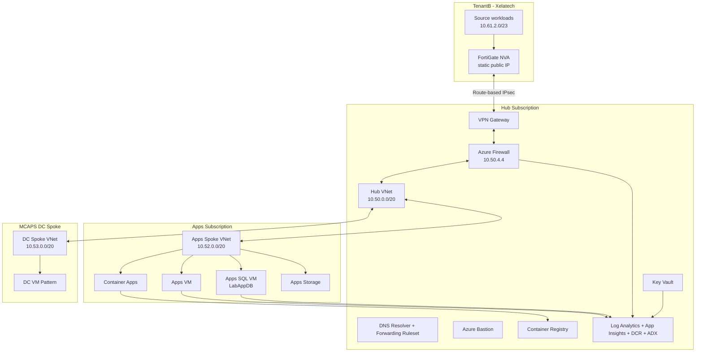

# SRE-Demo One-Pager

Date: 2026-09-03
Purpose: Fast mental refresh of what this repo deploys, why it exists, and how the parts fit together.

## What This Demo Is

SRE-Demo is an Azure hub-spoke landing zone and operations demo. It builds a controlled Azure environment that can show hybrid network routing, firewall inspection, VM and SQL workload placement, observability, and SRE-style operational health checks.

The repo is demo-first today, with a path toward production-grade IaC posture through AVM adoption, CAF alignment, and security/governance hardening.

### Azure Contexts

The demo uses two Azure tenant contexts:

| Context | Purpose | Subscription |
| --- | --- | --- |
| MCAPS tenant | Landing-zone hub, apps target, shared services, migration control plane, and destination | Hub `ebc6a927-fe4b-49dc-8e99-3ffe8e8d01d9`, Apps `42021d44-97d2-47a1-8245-a77149dda4c3` |
| TenantB (`xelatech.net`) | Independent source estate behind a FortiGate NVA | Visual Studio subscription `ed70102f-f789-4d4e-ac00-074283844a0c` |

Treat TenantB as the source estate and MCAPS as the migration target. Always verify the active tenant and subscription before running commands:

```bash
az login --tenant xelatech.net
az account set --subscription ed70102f-f789-4d4e-ac00-074283844a0c
az account show --query '{tenantId:tenantId, subscriptionId:id, name:name, user:user.name}' -o table
```

Deploy TenantB from `main/tenantb/tenantbmain.bicep` in a dedicated TenantB login. Deploy MCAPS separately and pass only the TenantB FortiGate public IP and CIDRs into the MCAPS VPN configuration. No cross-tenant Azure resource IDs are used.

## What It Deploys

Primary deployment entry points:

- `main/hub/hubmain.bicep` - hub subscription and shared platform services
- `main/apps-spoke/appsmain.bicep` - apps spoke workloads and app platform resources
- `main/tenantb/tenantbmain.bicep` - TenantB VNet, FortiGate NVA, and source network
- `main/dc-spoke/dcmain.bicep` - optional MCAPS infrastructure spoke pattern
- `platform/` - identity, management group, subscription, and policy scaffolding

Core components:

| Area | Components | Purpose |
|---|---|---|
| Hub network | Hub VNet, Azure Firewall, route tables, VPN Gateway, DNS Resolver | Central transit, inspection, hybrid routing, DNS forwarding |
| MCAPS spokes | Apps and optional DC VNets | Isolated workload zones connected through hub controls |
| TenantB source | FortiGate NVA, source VNet, and workload subnet | Independent remote site connected by IPsec |
| Compute | Windows VMs, Linux VMs, SQL VMs | Demo workloads, migration sources, troubleshooting targets |
| App platform | Container Apps, ACR, storage | Application hosting and image/artifact platform |
| Security | Key Vault, managed identities, RBAC assignments | Secrets, identity-based access, platform permissions |
| Observability | Log Analytics, App Insights, DCRs, VM Insights, ADX | Central logs, metrics, traces, SRE dashboards, health queries |
| Governance | Management group and policy scaffolding | CAF-style guardrails, currently needing more assignments |

## Network View

CIDR layout:

| Zone | Address Space | Notes |
|---|---|---|
| Hub | `10.50.0.0/20` | Firewall, VPN Gateway, DNS, Bastion, shared services |
| Apps spoke | `10.52.0.0/20` | App VM, SQL VM, storage, container apps |
| DC spoke | `10.53.0.0/20` | Optional MCAPS infrastructure pattern |
| TenantB | `10.61.0.0/20` | FortiGate and migration-source network |



## Routing Intent

- MCAPS spokes send default and TenantB-bound traffic to Azure Firewall at `10.50.4.4`.
- Firewall is the inspection point for east-west, egress, and hybrid paths.
- Firewall subnet permits gateway route propagation so it learns static TenantB LNG prefixes even though VPN BGP is disabled.
- Gateway subnet has routes to send traffic back through the firewall where required.
- Bastion provides admin access without direct public VM exposure.

## Lab Spoke Workload Intent

### Hub Shared Services

The hub is the lab control plane, not a normal workload spoke. It hosts the common platform services that the workload spokes depend on: Azure Firewall, VPN Gateway, DNS Resolver, Bastion, Key Vault, ACR, shared managed identities, Log Analytics, App Insights, VM Insights DCRs, ADX, and supporting storage.

Lab intent:

- Prove the landing zone/shared-services model.
- Centralize inspection and routing through Azure Firewall.
- Provide shared observability for hub, apps, and optional MCAPS infrastructure workloads.
- Preserve `hubRG-Monitor` across rebuilds so SRE agent and monitoring resources survive lab teardown cycles.

### Apps Spoke

The apps spoke is the application workload zone. It represents the application side of the lab and the likely target area for app modernization or migration demos.

Network:

- VNet: `10.52.0.0/20`
- VM subnet: `10.52.0.0/24`
- App subnet: `10.52.1.0/24`
- Private endpoint subnet: `10.52.10.0/24`

Workloads:

- `AppsVM`: Windows Server app VM for general workload/testing scenarios.
- `AppsLinuxVM...`: Linux VM for ops, connectivity, DNS, and firewall path testing.
- `AppsSQLVM`: SQL Server 2022 Developer VM tagged as an Azure Migrate source.
- Apps storage account with `inputs`, `outputs`, and `errors` blob containers plus `notesdoc` file share.
- Container Apps environment hosting `grubify-api` and `grubify-frontend` when Grubify images are ready.

Lab intent:

- Show a realistic app spoke with VM, SQL, storage, and containerized app workloads.
- Exercise VM Insights, AMA, DCR associations, and dependency maps.
- Demonstrate firewall-controlled egress and hub-routed east-west/hybrid traffic.
- Provide app and SQL resources that can participate in migration and modernization demos.

### TenantB Source Environment

TenantB is the logical legacy source environment for migration labs. It is independently deployed in the Xelatech Visual Studio subscription (`ed70102f-f789-4d4e-ac00-074283844a0c`), separate from the MCAPS migration target.

Network:

- VNet: `10.61.0.0/20`
- FortiGate external subnet: `10.61.0.0/27`
- FortiGate internal subnet: `10.61.0.32/27`
- Management subnet: `10.61.1.0/24`
- Source workload subnet: `10.61.2.0/23`

Planned source workloads:

- Arc server: a supported Windows Server VM used to demonstrate Connected Machine onboarding and hybrid governance.
- Legacy SQL source: an x64 Windows Server 2019 VM with SQL Server 2016 SP3 Developer for Azure Migrate discovery, Arc-enabled SQL inventory, assessment, and migration.
- Low-cost FortiGate PAYG NVA providing the route-based VPN endpoint and TenantB policy boundary.

Important boundaries:

- The retired Tahubu Windows Server 2012 R2/SQL Server 2014 community image is no longer a deployable source.
- A direct Azure VM can simulate an Arc-enabled server for evaluation only after following Microsoft's Azure VM evaluation procedure.
- Arc-enabled SQL Server does not support SQL Server installed directly on an Azure VM. For the combined Arc SQL demo, run the x64 SQL source as a nested guest or on another external x64 host; use the Xelatech subscription only to host the lab boundary.
- Host the source compute in TenantB, but register the nested/external guest's Arc resource and create the Azure Migrate project in MCAPS so discovery, assessment, and migration are demonstrated from the target control plane. Grant only the required onboarding and migration roles.

Lab intent:

- Represent the source side of a migration story.
- Demonstrate cross-tenant Azure Arc onboarding for a legacy-style Windows workload.
- Demonstrate SQL discovery, assessment, and migration from Xelatech into MCAPS targets.
- Keep legacy/data workloads separate from the apps modernization target area.

### MCAPS Infrastructure Spoke

The DC spoke is a lightweight expansion area for MCAPS infrastructure patterns. It is less built out than the apps spoke today.

Network:

- VNet: `10.53.0.0/20`
- VM subnet: `10.53.0.0/24`
- Apps subnet: `10.53.1.0/24`
- Private endpoint subnet: `10.53.10.0/24`

Workloads:

- `dcVM`: small Windows VM placeholder for MCAPS infrastructure scenarios.

Lab intent:

- Reserve a spoke for future domain or infrastructure services.
- Reuse the same spoke routing model through the hub firewall.
- Provide room to expand MCAPS network and identity demos without overloading the apps spoke.

## Demo Storyline

This environment can support several demos:

1. Landing zone structure: hub-spoke, subscriptions, resource groups, policies, identities.
2. Hybrid connectivity: TenantB FortiGate routes over VPN into MCAPS.
3. Network inspection: Azure Firewall controls DNS, internet egress, east-west, and TenantB traffic.
4. Migration scenario: SQL source VM and LabAppDB can represent app/data migration sources.
5. SRE operations: VM Insights, Log Analytics, App Insights, ADX, and health KQL show operational telemetry.
6. Resiliency/governance evolution: recommendations backlog tracks what moves this from demo to production-ready.

## Deploy Order

1. Platform/management scaffolding as needed.
2. Hub deployment.
3. TenantB deployment from a separate TenantB login.
4. Exchange VPN endpoint metadata and inject the PSK out of band.
5. Validate the route-based IPsec tunnel and symmetric firewall path.
6. Apps spoke deployment.
7. Validation scripts for VM Insights and firewall/DNS path.

## AVM Posture

Current AVM adoption is strong but incomplete:

- 60 total Bicep module invocations
- 41 AVM module invocations
- 19 non-AVM module invocations
- 68.33% AVM adoption by invocation

Long-term recommendation: yes, it is worth converting toward AVM, but selectively.

Convert when:

- The custom module mostly creates a standard Azure resource.
- AVM supports the needed child resources, diagnostics, role assignments, locks, private endpoints, and outputs.
- Conversion reduces maintenance or improves consistency without hiding important network intent.

Keep custom or hybrid when:

- The module encodes complex orchestration, cross-subscription dependency handling, or route/firewall policy logic.
- AVM cannot cleanly represent the exact behavior without creating a harder-to-read parent template.
- The custom module is acting as a demo narrative boundary, not just a resource wrapper.

Best near-term conversion targets:

1. VNet peering module (`modules/hub/vnet-peering.bicep`)
2. Diagnostics wrappers where AVM module diagnostic settings already cover the use case

Completed AVM cleanup:

- `modules/apps/grubifyFrontend.bicep` removed; `main/apps-spoke/appsmain.bicep` now calls `br/public:avm/res/app/container-app:0.22.0` directly.
- `modules/apps/containerApp.bicep` removed; `main/apps-spoke/appsmain.bicep` now calls AVM Managed Environment and Container App modules directly.
- `modules/spokes/spokevnets.bicep` retained as a stable wrapper; internals now use AVM Route Table and AVM Virtual Network modules.
- `modules/hub/hubvnet.bicep` retained as a stable wrapper; internals now use AVM Route Table and AVM Virtual Network modules.
- `modules/hub/firewall-vnet.bicep` retained as a firewall orchestration wrapper; base Azure Firewall, Firewall Policy, and rule collection groups now use AVM modules.
- `modules/hub/privatednslinks.bicep` retained as a Private DNS orchestration wrapper; DNS zones and virtual network links now use AVM Private DNS Zone modules.

Best modules to retain or convert hybrid:

- Firewall module: use AVM for base firewall if practical, keep custom rule/policy structure if it preserves clarity.
- Governance/platform modules: likely keep custom because they express orchestration and organizational intent.
- Identity orchestration: keep custom unless AVM can simplify identity creation without complicating role assignment flow.

Detailed inventory: `docs/avm-module-review.md`

## Near-Term Readiness Focus

Before a serious deploy, prioritize:

1. Remove credential values from docs and rotate exposed demo secrets.
2. Tighten Key Vault protection settings for production paths.
3. Decide which public endpoints are acceptable for demo and document exceptions.
4. Convert obvious resource-wrapper custom modules to AVM.
5. Add baseline governance assignments.
6. Run Bicep build/what-if for hub, apps, and data deployments.

## Related Docs

- `docs/architecture.md` - full architecture notes and deploy commands
- `docs/avm-module-review.md` - AVM inventory and migration backlog
- `docs/caf-iac-recommendations.md` - CAF/IaC hardening backlog
- `scripts/README.md` - operational validation scripts
