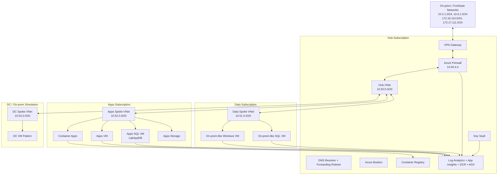

# SRE-Demo One-Pager

Date: 2026-09-03
Purpose: Fast mental refresh of what this repo deploys, why it exists, and how the parts fit together.

## What This Demo Is

SRE-Demo is an Azure hub-spoke landing zone and operations demo. It builds a controlled Azure environment that can show hybrid network routing, firewall inspection, VM and SQL workload placement, observability, and SRE-style operational health checks.

The repo is demo-first today, with a path toward production-grade IaC posture through AVM adoption, CAF alignment, and security/governance hardening.

## What It Deploys

Primary deployment entry points:

- `main/hub/hubmain.bicep` - hub subscription and shared platform services
- `main/apps-spoke/appsmain.bicep` - apps spoke workloads and app platform resources
- `main/data-spoke/datamain.bicep` - data/on-prem simulation workloads
- `main/dc-spoke/dcmain.bicep` - DC/on-prem spoke pattern
- `platform/` - identity, management group, subscription, and policy scaffolding

Core components:

| Area | Components | Purpose |
|---|---|---|
| Hub network | Hub VNet, Azure Firewall, route tables, VPN Gateway, DNS Resolver | Central transit, inspection, hybrid routing, DNS forwarding |
| Spokes | Apps, data, and DC/on-prem-style VNets | Isolated workload zones connected through hub controls |
| Compute | Windows VMs, Linux VMs, SQL VMs | Demo workloads, migration sources, troubleshooting targets |
| App platform | Container Apps, ACR, storage | Application hosting and image/artifact platform |
| Security | Key Vault, managed identities, RBAC assignments | Secrets, identity-based access, platform permissions |
| Observability | Log Analytics, App Insights, DCRs, VM Insights, ADX | Central logs, metrics, traces, SRE dashboards, health queries |
| Governance | Management group and policy scaffolding | CAF-style guardrails, currently needing more assignments |

## Network View

CIDR layout:

| Zone | Address Space | Notes |
|---|---|---|
| Hub | `10.50.0.0/20` | Firewall, VPN Gateway, DNS, Bastion, shared services |
| Data spoke | `10.51.0.0/20` | Data and migration-source style VMs |
| Apps spoke | `10.52.0.0/20` | App VM, SQL VM, storage, container apps |
| On-prem/DC spoke | `10.53.0.0/20` | Future/on-prem simulation pattern |
| Real on-prem routes | `10.2.1.0/24`, `10.6.1.0/24`, `172.16.110.0/24`, `172.17.111.0/24` | Advertised/handled through FortiGate/VPN path |

## Routing Intent

- Spokes send default and on-prem-bound traffic to Azure Firewall at `10.50.4.4`.
- Firewall is the inspection point for east-west, egress, and hybrid paths.
- Firewall subnet keeps BGP enabled so it can learn on-prem routes through the VPN path.
- Gateway subnet has routes to send traffic back through the firewall where required.
- Bastion provides admin access without direct public VM exposure.

## Demo Storyline

This environment can support several demos:

1. Landing zone structure: hub-spoke, subscriptions, resource groups, policies, identities.
2. Hybrid connectivity: FortiGate/on-prem routes over VPN into Azure.
3. Network inspection: Azure Firewall controls DNS, internet egress, and east-west/on-prem traffic.
4. Migration scenario: SQL source VM and LabAppDB can represent app/data migration sources.
5. SRE operations: VM Insights, Log Analytics, App Insights, ADX, and health KQL show operational telemetry.
6. Resiliency/governance evolution: recommendations backlog tracks what moves this from demo to production-ready.

## Deploy Order

1. Platform/management scaffolding as needed.
2. Hub deployment.
3. VPN and peering updates when hybrid path is required.
4. Data spoke deployment.
5. Apps spoke deployment.
6. Validation scripts for VM Insights and firewall/DNS path.

## AVM Posture

Current AVM adoption is strong but incomplete:

- 53 total Bicep module invocations
- 34 AVM module invocations
- 19 non-AVM module invocations
- 64.15% AVM adoption by invocation

Long-term recommendation: yes, it is worth converting toward AVM, but selectively.

Convert when:

- The custom module mostly creates a standard Azure resource.
- AVM supports the needed child resources, diagnostics, role assignments, locks, private endpoints, and outputs.
- Conversion reduces maintenance or improves consistency without hiding important network intent.

Keep custom or hybrid when:

- The module encodes complex orchestration, cross-subscription dependency handling, or route/firewall policy logic.
- AVM cannot cleanly represent the exact behavior without creating a harder-to-read parent template.
- The custom module is acting as a demo narrative boundary, not just a resource wrapper.

Best near-term conversion targets:

1. VNet peering module (`modules/hub/vnet-peering.bicep`)
2. Diagnostics wrappers where AVM module diagnostic settings already cover the use case

Completed AVM cleanup:

- `modules/apps/grubifyFrontend.bicep` removed; `main/apps-spoke/appsmain.bicep` now calls `br/public:avm/res/app/container-app:0.22.0` directly.
- `modules/apps/containerApp.bicep` removed; `main/apps-spoke/appsmain.bicep` now calls AVM Managed Environment and Container App modules directly.
- `modules/spokes/spokevnets.bicep` retained as a stable wrapper; internals now use AVM Route Table and AVM Virtual Network modules.
- `modules/hub/hubvnet.bicep` retained as a stable wrapper; internals now use AVM Route Table and AVM Virtual Network modules.
- `modules/hub/firewall-vnet.bicep` retained as a firewall orchestration wrapper; base Azure Firewall now uses AVM while policy and rule collection groups remain custom.

Best modules to retain or convert hybrid:

- Firewall module: use AVM for base firewall if practical, keep custom rule/policy structure if it preserves clarity.
- Governance/platform modules: likely keep custom because they express orchestration and organizational intent.
- Identity orchestration: keep custom unless AVM can simplify identity creation without complicating role assignment flow.

Detailed inventory: `docs/avm-module-review.md`

## Near-Term Readiness Focus

Before a serious deploy, prioritize:

1. Remove credential values from docs and rotate exposed demo secrets.
2. Tighten Key Vault protection settings for production paths.
3. Decide which public endpoints are acceptable for demo and document exceptions.
4. Convert obvious resource-wrapper custom modules to AVM.
5. Add baseline governance assignments.
6. Run Bicep build/what-if for hub, apps, and data deployments.

## Related Docs

- `docs/architecture.md` - full architecture notes and deploy commands
- `docs/avm-module-review.md` - AVM inventory and migration backlog
- `docs/caf-iac-recommendations.md` - CAF/IaC hardening backlog
- `scripts/README.md` - operational validation scripts
